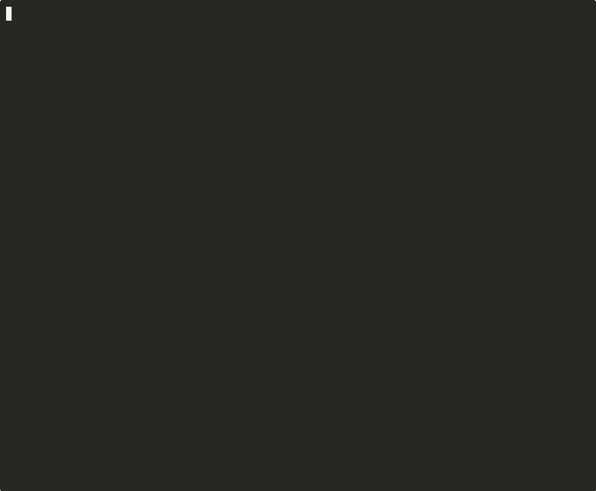

<p align="center">
  
</p>

<p align="center">
  <b>One command to deploy your self-hosted stack.</b><br>
  <sub>Interactive CLI for Docker Compose — guided setup, auto-generated secrets, zero YAML editing.</sub>
</p>

<p align="center">
  <a href="https://github.com/m1ngsama/automa/releases"></a>
  <a href="https://github.com/m1ngsama/automa/blob/main/LICENSE"></a>
  <a href="https://github.com/m1ngsama/automa/commits/main"></a>
  
  
</p>

<br>

<p align="center">
  
</p>

---

## Quick Start

```bash
curl -fsSL https://raw.githubusercontent.com/m1ngsama/automa/main/install.sh | bash
cd ~/automa
./automa deploy
```

That's it. The installer checks prerequisites, clones the repo, and you're ready to deploy.

## Features

- **Interactive CLI** — select projects from a numbered menu, guided `.env` setup with hints
- **Zero config** — sensible defaults for every project, passwords and secrets auto-generated
- **Non-interactive mode** — `automa -y deploy` accepts all defaults for CI/scripts
- **Self-contained projects** — each is an independent directory, no shared dependencies
- **Production-ready** — health checks, security hardening, least-privilege containers
- **Extensible** — drop in a `compose.yaml` + `.env.example` and automa discovers it

## Bundled Projects

| Project | Description | Default Port | Upstream |
|---------|-------------|:------------:|----------|
| **Forgejo** | Self-hosted Git service (Gitea fork) | `3000` | [forgejo.org](https://forgejo.org) |
| **Nextcloud** | Private cloud with MariaDB + Redis | `8080` | [nextcloud.com](https://nextcloud.com) |
| **Uptime Kuma** | Uptime monitoring dashboard | `3001` | [GitHub](https://github.com/louislam/uptime-kuma) |
| **Tailscale** | Mesh VPN client + optional DERP relay | host | [tailscale.com](https://tailscale.com) |
| **Filesuite** | Cloudreve cloud storage + qBittorrent | `5212` `8090` | [cloudreve.org](https://cloudreve.org) |
| **Minecraft** | Fabric server (itzg/minecraft-server) | `25565` | [Docs](https://docker-minecraft-server.readthedocs.io) |
| **TeamSpeak** | Voice communication server | `9987/udp` | [teamspeak.com](https://teamspeak.com) |

<details>
<summary><b>Project-specific notes</b></summary>

#### Tailscale

Uses Docker Compose profiles — deploy only the VPN client or include the DERP relay:

```bash
# Tailscale client only
docker compose --profile tailscale up -d

# Client + DERP relay
docker compose --profile derp up -d
```

#### Nextcloud

Ships with MariaDB 11 and Redis 7 as backing services. All three containers have health checks with `depends_on` ordering. First startup takes ~60s for database migration.

#### Minecraft

Uses the [itzg/minecraft-server](https://docker-minecraft-server.readthedocs.io) image with Fabric mod loader. Mods go in `minecraft/data/mods/`. First startup takes ~2 minutes to download server files.

</details>

## Usage

```bash
automa deploy                       # interactive project selection
automa deploy forgejo nextcloud     # deploy specific projects
automa -y deploy forgejo            # non-interactive (CI/scripts)
automa status                       # overview dashboard
automa logs minecraft               # follow container logs
automa stop forgejo                 # stop a project
automa restart nextcloud            # restart a project
automa update nextcloud             # pull latest images & recreate
automa config tailscale             # reconfigure .env
automa list                         # list all projects
```

## How It Works

```
~/automa/
├── automa                 # CLI entry point (single bash script)
├── install.sh             # curl-pipe-bash installer
├── forgejo/
│   ├── compose.yaml       # Docker Compose definition
│   ├── .env.example       # Template with @metadata + defaults
│   └── .env               # Your config (gitignored, created by CLI)
├── nextcloud/
│   └── ...
└── ...
```

Each `.env.example` carries metadata that the CLI reads:

```bash
# @name Forgejo
# @desc Self-hosted Git service (Gitea fork)
# @url https://forgejo.org
# @port FORGEJO_HTTP_PORT
```

The CLI uses these annotations to show project names, descriptions, docs links, and access URLs — all without extra configuration files.

## Requirements

| Dependency | Minimum | Check |
|------------|---------|-------|
| Docker | 20.10+ | `docker --version` |
| Docker Compose | v2 (plugin) | `docker compose version` |
| Bash | 4.0+ | `bash --version` |
| Git | any | `git --version` |

The installer verifies all prerequisites automatically.

## Uninstall

```bash
cd ~/automa
./automa stop <each-project>    # stop running containers
cd ~ && rm -rf ~/automa         # remove automa
```

Data is stored in each project's `data/` directory. Back up before removing if needed.

## Contributing

Contributions welcome! To add a new project:

1. Create a directory with `compose.yaml` (include health checks)
2. Add `.env.example` with metadata headers (`@name`, `@desc`, `@url`, `@port`)
3. Open a pull request

See existing projects for reference.

## License

[MIT](LICENSE) &copy; [m1ngsama](https://github.com/m1ngsama)
